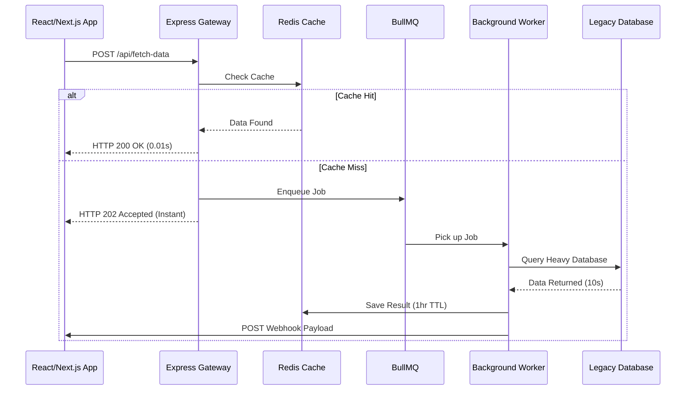

# 🌉 AsyncBridge

> **Stop 504 Gateway Timeouts when connecting modern apps to legacy databases.**


AsyncBridge is a lightweight, Twelve-Factor, Dockerized asynchronous middleware gateway. 

It sits between your high-performance frontends (Next.js/React) and your slow, legacy backend systems. Instead of forcing the client to wait 10+ seconds for a legacy DB query (resulting in UI freezes or 504 Gateway Timeouts), AsyncBridge accepts the request, safely queues it, and fires a webhook to your frontend when the data is ready. 

## ✨ Features
* **Zero-Blocking Architecture:** Instantly returns an `HTTP 202 Accepted` to the client.
* **Persistent Queuing:** Powered by Redis and BullMQ to ensure no request is ever dropped.
* **Lightning Cache:** Built-in Redis caching layer turns repeated 10-second queries into 10-millisecond cache hits.
* **Webhook Dispatch:** Automatically pings your frontend service when background processing completes.
* **Fully Containerized:** Runs anywhere with a single Docker command.

---

## 🚀 1-Minute Quickstart

You can test the entire architecture on your local machine right now without installing Node or Redis. 

### 1. Clone & Configure
```bash
git clone [https://github.com/owais-amir-27/async-bridge.git](https://github.com/owais-amir-27/async-bridge.git)
cd async-bridge
cp .env.example .env
```

### 2. Start the Engine
```bash
docker-compose up --build
```

### 3. Send a Test Request
Open a new terminal and send a POST request to the API.

**For Mac/Linux (bash):**
```bash
curl -X POST http://localhost:3000/api/fetch-data \
     -H "Content-Type: application/json" \
     -d '{"query": "get_mortgage_history", "user": "Owais"}'
```

**For Windows (PowerShell):**
```powershell
Invoke-RestMethod -Uri http://localhost:3000/api/fetch-data -Method POST -Headers @{"Content-Type"="application/json"} -Body '{"query": "get_mortgage_history", "user": "Owais"}'
```

**What happens next?**
1. Watch the terminal logs: The server will instantly accept the request.
2. The background worker will pick it up and simulate a 10-second legacy database query.
3. The result is cached, and a webhook is fired to the local receiver.
4. **Send the exact same request again:** Watch the cache catch it and return the data in 0.01 seconds.

---

## 🏗️ Architecture



## ⚙️ Environment Variables
Configure the bridge without touching the source code. See `.env.example` for defaults:
* `PORT`: The API listening port.
* `REDIS_HOST` / `REDIS_PORT`: Your Redis connection details.
* `WEBHOOK_RECEIVER_URL`: Where the worker should send the final data.